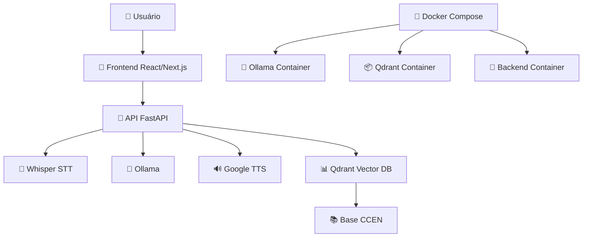

# 🤖 Assistente Virtual CCEN - TTS App

<div align="center">


**Assistente Virtual Inteligente para o Centro de Ciências Exatas e da Natureza (CCEN) da UFPE**

Um sistema completo de conversação por voz e texto com IA, desenvolvido especificamente para responder dúvidas sobre professores, departamentos e informações acadêmicas do CCEN.

</div>

## 🌟 Principais Funcionalidades

### 🎯 **Sistema de IA Conversacional**
- **Chat inteligente** com modelos locais (Ollama)
- **RAG (Retrieval-Augmented Generation)** com base de conhecimento específica do CCEN
- **Busca vetorial** avançada com Qdrant para respostas precisas

### 🎤 **Speech-to-Text (STT)**
- Transcrição de áudio em tempo real com **OpenAI Whisper**
- Interface de gravação moderna e intuitiva

### 🔊 **Text-to-Speech (TTS)**
- Síntese de voz natural com **Google TTS (gTTS)**
- Reprodução automática de respostas
- Controle de ativação/desativação por usuário

### 📱 **Interface Multiplataforma**
- **Web App** (Next.js + Tailwind CSS)
- **App Android** nativo com Capacitor
- **PWA** (Progressive Web App) para instalação offline
- **Modo Kiosk** para uso em totems e dispositivos dedicados

## 🏗️ Arquitetura do Sistema



## 🚀 Instalação e Configuração

### 📋 Pré-requisitos

#### **Hardware Recomendado**
- **RAM**: 16GB+ (32GB recomendado para modelos grandes)
- **GPU**: NVIDIA com CUDA 11.8+ (opcional, mas recomendado)

#### **Software Base**
```bash
# Node.js e npm
node --version  # v18.0.0+
npm --version   # v8.0.0+

# Python
python --version  # 3.10.11

# Docker
docker --version         # 20.0.0+
docker-compose --version # 2.0.0+

### 🔧 Dependências Específicas

#### **Windows**
```powershell
# Chocolatey
Set-ExecutionPolicy Bypass -Scope Process -Force; [System.Net.ServicePointManager]::SecurityProtocol = [System.Net.ServicePointManager]::SecurityProtocol -bor 3072; iex ((New-Object System.Net.WebClient).DownloadString('https://community.chocolatey.org/install.ps1'))

# FFmpeg para processamento de áudio
choco install ffmpeg

# Visual C++ Build Tools
Download: https://visualstudio.microsoft.com/pt-br/visual-cpp-build-tools/

# CUDA Toolkit (para GPU)
Download: https://developer.nvidia.com/cuda-11-8-0-download-archive
```

### 📥 Clonagem e Setup Inicial

```bash
# 1. Clonar repositório
git clone https://github.com/seu-usuario/TTS-app.git
```
Configurar arquivo .env em backend

### 🔐 Configuração de Variáveis de Ambiente

Exemplo de como criar o arquivo `.env` no diretório `backend/`:

```bash
# === CONFIGURAÇÕES DE IA ===
MODEL_NAME="qwen3:4b" # Modelo Ollama local
EMBED_MODEL="all-minilm:l6-v2"

# === CONFIGURAÇÕES QDRANT ===
COLLECTION_NAME="ccen-docentes"

# === MONITORAMENTO (OPCIONAL) ===
LANGSMITH_TRACING="true"
LANGSMITH_ENDPOINT="https://api.smith.langchain.com"
LANGSMITH_PROJECT="backend"
LANGSMITH_API_KEY="sua-chave-langsmith"
```

### 🐋 Inicialização do servidor

Executar o arquivo AssistenteVirtualCCEN.bat

## 📱 Build do App Android

### 🔧 Pré-requisitos Android

```bash
# 1. Java JDK 21

# 2. Android Studio

# 3. Configurar variáveis de ambiente
$env:JAVA_HOME="C:\Program Files\Java\jdk-21"  # Windows
```

### 📦 Build APK

```bash
cd tts-app-next

npm run cap:build

cd android
./gradlew.bat assembleDebug  # Windows
```

O APK será gerado em: `android/app/build/outputs/apk/debug/`

## 🎮 Como Usar

### 📱 **App Android**
1. Instale o APK gerado
2. Configure permissões de **microfone** e **armazenamento**

## 🤝 Contribuição

Contribuições são muito bem-vindas! Por favor:

1. **Fork** o repositório
2. Crie uma **branch** para sua feature (`git checkout -b feature/AmazingFeature`)
3. **Commit** suas mudanças (`git commit -m 'Add some AmazingFeature'`)
4. **Push** para a branch (`git push origin feature/AmazingFeature`)
5. Abra um **Pull Request**

## 📄 Licença

Este projeto está licenciado sob a licença MIT - veja o arquivo [LICENSE](LICENSE) para detalhes.

## 🏫 Sobre o CCEN/UFPE

Este assistente foi desenvolvido especificamente para o **Centro de Ciências Exatas e da Natureza (CCEN)** da **Universidade Federal de Pernambuco (UFPE)**, visando facilitar o acesso a informações sobre professores, departamentos e recursos acadêmicos.

---

<div align="center">

**Desenvolvido com ❤️ para a comunidade acadêmica do CCEN/UFPE**

[🌐 UFPE](https://www.ufpe.br) • [🏫 CCEN](https://www.ufpe.br/ccen)

</div>