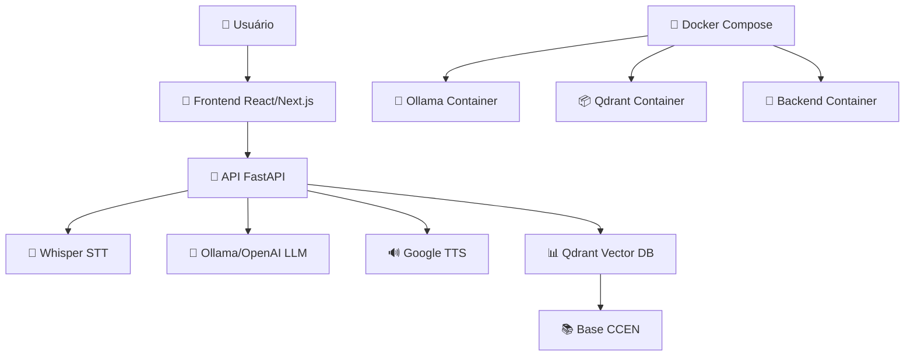

# 🤖 Assistente Virtual CCEN - TTS App

<div align="center">


**Assistente Virtual Inteligente para o Centro de Ciências Exatas e da Natureza (CCEN) da UFPE**

Um sistema completo de conversação por voz e texto com IA, desenvolvido especificamente para responder dúvidas sobre professores, departamentos e informações acadêmicas do CCEN.

</div>

## 🌟 Principais Funcionalidades

### 🎯 **Sistema de IA Conversacional**
- **Chat inteligente** com modelos locais (Ollama) ou OpenAI
- **RAG (Retrieval-Augmented Generation)** com base de conhecimento específica do CCEN
- **Busca vetorial** avançada com Qdrant para respostas precisas

### 🎤 **Speech-to-Text (STT)**
- Transcrição de áudio em tempo real com **OpenAI Whisper**
- Suporte a múltiplos idiomas (otimizado para português)
- Interface de gravação moderna e intuitiva

### 🔊 **Text-to-Speech (TTS)**
- Síntese de voz natural com **Google TTS (gTTS)**
- Reprodução automática de respostas
- Controle de ativação/desativação por usuário

### 📱 **Interface Multiplataforma**
- **Web App** responsivo e moderno (Next.js + Tailwind CSS)
- **App Android** nativo com Capacitor
- **PWA** (Progressive Web App) para instalação offline
- **Modo Kiosk** para uso em totems e dispositivos dedicados

### 🎨 **Design Moderno**
- Interface baseada em **shadcn/ui** components
- Animações suaves com **Framer Motion**
- Design responsivo e acessível
- Tema dark/light (configurável)

## 🏗️ Arquitetura do Sistema



## 🚀 Instalação e Configuração

### 📋 Pré-requisitos

#### **Sistema Operacional**
- Windows 10/11 (com WSL2 para desenvolvimento)
- Linux (Ubuntu 20.04+ recomendado)
- macOS (suporte limitado para GPU)

#### **Hardware Recomendado**
- **RAM**: 16GB+ (32GB recomendado para modelos grandes)
- **GPU**: NVIDIA com CUDA 11.8+ (opcional, mas recomendado)
- **Armazenamento**: 50GB+ livres
- **Processador**: CPU x64 com 4+ cores

#### **Software Base**
```bash
# Node.js e npm
node --version  # v18.0.0+
npm --version   # v8.0.0+

# Python
python --version  # 3.10.11

# Docker
docker --version         # 20.0.0+
docker-compose --version # 2.0.0+

# Git
git --version
```

### 🔧 Dependências Específicas

#### **Windows**
```powershell
# Chocolatey (se não tiver)
Set-ExecutionPolicy Bypass -Scope Process -Force; [System.Net.ServicePointManager]::SecurityProtocol = [System.Net.ServicePointManager]::SecurityProtocol -bor 3072; iex ((New-Object System.Net.WebClient).DownloadString('https://community.chocolatey.org/install.ps1'))

# FFmpeg para processamento de áudio
choco install ffmpeg

# Visual C++ Build Tools
# Download: https://visualstudio.microsoft.com/pt-br/visual-cpp-build-tools/

# CUDA Toolkit (para GPU)
# Download: https://developer.nvidia.com/cuda-11-8-0-download-archive
```

#### **Linux (Ubuntu/Debian)**
```bash
# FFmpeg
sudo apt update
sudo apt install ffmpeg

# Build essentials
sudo apt install build-essential

# CUDA (se tiver GPU NVIDIA)
# Siga: https://developer.nvidia.com/cuda-downloads
```

#### **Rust (necessário para algumas dependências Python)**
```bash
# Windows/Linux/macOS
curl --proto '=https' --tlsv1.2 -sSf https://sh.rustup.rs | sh
source ~/.cargo/env
```

### 📥 Clonagem e Setup Inicial

```bash
# 1. Clonar repositório
git clone https://github.com/seu-usuario/TTS-app.git
cd TTS-app

# 2. Configurar backend
cd backend
python -m venv tts-env
source tts-env/bin/activate  # Linux/macOS
# ou
tts-env\Scripts\activate     # Windows

pip install -r requirements.txt

# 3. Configurar frontend
cd ../tts-app-next
npm install

# 4. Preparar Docker
cd ../backend
docker-compose pull
```

### 🔐 Configuração de Variáveis de Ambiente

Crie o arquivo `.env` no diretório `backend/`:

```bash
# === CONFIGURAÇÕES DO SERVIDOR ===
SERVER_HOST=0.0.0.0
SERVER_PORT=8000

# === CONFIGURAÇÕES DE IA ===
MODEL_NAME=phi4:latest          # Modelo Ollama local
USE_LOCAL_MODEL=true
EMBED_MODEL=all-minilm:l6-v2

# === CONFIGURAÇÕES QDRANT ===
QDRANT_URL=http://localhost:6333
QDRANT_API_KEY=                 # Deixe vazio para instância local
USE_LOCAL_COLLECTION=true
COLLECTION_NAME=ccen-docentes

# === CONFIGURAÇÕES OLLAMA ===
OLLAMA_BASE_URL=http://localhost:11434

# === APIS EXTERNAS (OPCIONAL) ===
OPENAI_API_KEY=sua-chave-openai-aqui  # Opcional, para usar OpenAI

# === MONITORAMENTO (OPCIONAL) ===
LANGSMITH_TRACING=true
LANGSMITH_ENDPOINT=https://api.smith.langchain.com
LANGSMITH_PROJECT=backend
LANGSMITH_API_KEY=sua-chave-langsmith  # Opcional

# === CONFIGURAÇÕES CUDA ===
NVIDIA_VISIBLE_DEVICES=all
CUDA_VISIBLE_DEVICES=0
```

### 🐋 Inicialização com Docker (Recomendado)

#### **Desenvolvimento Completo**
```bash
cd backend

# Subir todos os serviços
docker-compose -f docker-compose.dev.yml up --build

# Em outro terminal, aguardar serviços ficarem online
# Ollama: http://localhost:11434
# Qdrant: http://localhost:6333
# Backend: http://localhost:8000
```

#### **Produção**
```bash
cd backend

# Produção otimizada
docker-compose up -d --build

# Verificar status
docker-compose ps
docker-compose logs -f tts-app
```

### 📚 Download dos Modelos IA

```bash
# 1. Conectar ao container Ollama
docker exec -it tts-ollama bash

# 2. Baixar modelo principal (escolha um)
ollama pull phi4:latest        # Recomendado (7B, equilibrado)
ollama pull llama3.2:latest    # Alternativo
ollama pull mistral:latest     # Mais leve

# 3. Baixar modelo de embeddings
ollama pull all-minilm:l6-v2

# 4. Testar modelos
ollama list
```

### 🎯 Configuração da Base de Conhecimento

```bash
# 1. Conectar ao container da aplicação
docker exec -it tts-app-backend bash

# 2. Processar documentos CCEN (se necessário)
python embeddings.py

# 3. Verificar coleção no Qdrant
curl http://localhost:6333/collections/ccen-docentes
```

### 🌐 Inicialização do Frontend

```bash
cd tts-app-next

# Desenvolvimento
npm run dev

# Produção
npm run build
npm run start

# HTTPS (para funcionalidades de áudio)
npm run dev:https
```

## 📱 Build do App Android

### 🔧 Pré-requisitos Android

```bash
# 1. Java JDK 21
# Download: https://adoptium.net/

# 2. Android Studio
# Download: https://developer.android.com/studio

# 3. Configurar variáveis de ambiente
$env:JAVA_HOME="C:\Program Files\Java\jdk-21"  # Windows
export JAVA_HOME="/usr/lib/jvm/java-21-openjdk" # Linux
```

### 📦 Build APK

```bash
cd tts-app-next

# 1. Build web otimizado
npm run build

# 2. Sincronizar com Capacitor
npm run cap:build

# 3. Abrir no Android Studio
npm run cap:open

# 4. Build via linha de comando
cd android
./gradlew.bat assembleDebug  # Windows
./gradlew assembleDebug      # Linux/macOS
```

O APK será gerado em: `android/app/build/outputs/apk/debug/`

## 🎮 Como Usar

### 💻 **Interface Web**
1. Acesse: http://localhost:3000
2. **Digite** sua pergunta ou **clique no microfone** para falar
3. Ative o **switch de áudio** para ouvir as respostas
4. Use o **botão de anexo** para enviar documentos

### 📱 **App Android**
1. Instale o APK gerado
2. Configure permissões de **microfone** e **armazenamento**
3. Interface touch otimizada para tablets e smartphones

### 🤖 **Exemplos de Perguntas**
```
- "Quem é o professor João Silva?"
- "Quais são os professores do departamento de Matemática?"
- "Me fale sobre o curso de Ciência da Computação"
- "Horários do professor Maria Santos"
- "Contato do departamento de Física"
```

## 🛠️ Scripts de Desenvolvimento

### 🔧 **Backend**
```bash
cd backend

# Iniciar servidor de desenvolvimento
python server.py

# Interface Gradio alternativa
python app.py

# Scripts automatizados
.\start_backend.bat                    # Windows simples
.\start_backend_interactive.bat       # Windows interativo
.\start_backend_universal.bat         # Windows universal
./start_backend.sh                    # Linux/macOS
```

### 🎨 **Frontend**
```bash
cd tts-app-next

# Desenvolvimento
npm run dev              # Padrão
npm run dev:https        # Com HTTPS

# Build e deploy
npm run build           # Build produção
npm run start           # Servidor produção
npm run preview         # Preview local

# Capacitor Android
npm run cap:init        # Inicializar
npm run cap:build       # Build e sync
npm run cap:run         # Build e executar
npm run cap:dev         # Modo desenvolvimento
```

## 🐳 Comandos Docker Úteis

### 🔄 **Gerenciamento Básico**
```bash
# Parar todos os serviços
docker-compose down

# Restart específico
docker-compose restart tts-app
docker-compose restart ollama

# Logs em tempo real
docker-compose logs -f
docker-compose logs -f tts-app

# Status dos containers
docker-compose ps
```

### 🧹 **Limpeza e Reset**
```bash
# ⚠️ ATENÇÃO: Remove TODOS os dados!

# Parar containers
docker-compose down

# Remover volumes (apaga modelos e dados)
docker volume rm backend_ollama_data backend_qdrant_data

# Rebuild completo
docker-compose up --build --force-recreate
```

### 🔍 **Debug e Monitoramento**
```bash
# Conectar aos containers
docker exec -it tts-app-backend bash      # Backend Python
docker exec -it tts-ollama bash           # Ollama
docker exec -it tts-qdrant bash           # Qdrant

# Monitorar recursos
docker stats

# Verificar volumes
docker volume ls
docker volume inspect backend_ollama_data
```

## 🚨 Solução de Problemas

### ❌ **Problemas Comuns**

#### **Docker não inicia**
```bash
# Windows: Verificar WSL2
wsl --status
wsl --update

# Linux: Verificar permissões
sudo usermod -aG docker $USER
newgrp docker
```

#### **Ollama não carrega modelos**
```bash
# Verificar espaço em disco
df -h

# Redownload do modelo
docker exec -it tts-ollama ollama pull phi4:latest

# Verificar memória
docker exec -it tts-ollama ollama list
```

#### **Qdrant não conecta**
```bash
# Verificar se está rodando
curl http://localhost:6333/health

# Restart forçado
docker-compose restart qdrant
```

#### **Audio não funciona (Web)**
- Usar **HTTPS** (required by browsers): `npm run dev:https`
- Verificar **permissões** do navegador
- **Chrome flags**: chrome://flags → "Experimental Web Platform features"

#### **Build Android falha**
```bash
# Limpar cache Gradle
cd android
./gradlew clean

# Verificar JAVA_HOME
echo $JAVA_HOME

# Rebuild
npm run cap:build
```

### 📊 **Monitoramento**

#### **Health Checks**
```bash
# Backend API
curl http://localhost:8000/health

# Ollama
curl http://localhost:11434/api/tags

# Qdrant
curl http://localhost:6333/health

# Frontend
curl http://localhost:3000
```

#### **Logs Importantes**
```bash
# Backend detalhado
docker-compose logs -f tts-app

# Ollama responses
docker-compose logs -f ollama

# Banco vetorial
docker-compose logs -f qdrant
```

## 🔧 Configurações Avançadas

### ⚡ **Otimização de Performance**

#### **WSL2 (Windows)**
Crie/edite `%USERPROFILE%\.wslconfig`:
```ini
[wsl2]
memory=16GB
processors=8
localhostForwarding=true
```

#### **CUDA Memory**
```bash
# Verificar GPU
nvidia-smi

# Ajustar no docker-compose.yml
environment:
  - CUDA_VISIBLE_DEVICES=0
  - NVIDIA_VISIBLE_DEVICES=all
```

### 🌐 **Deploy em Produção**

#### **Nginx Proxy (Recomendado)**
```nginx
server {
    listen 80;
    server_name seu-dominio.com;
    
    location /api/ {
        proxy_pass http://localhost:8000/;
        proxy_set_header Host $host;
        proxy_set_header X-Real-IP $remote_addr;
    }
    
    location / {
        proxy_pass http://localhost:3000/;
        proxy_set_header Host $host;
        proxy_set_header X-Real-IP $remote_addr;
    }
}
```

#### **SSL/HTTPS Setup**
```bash
# Certbot (Let's Encrypt)
sudo apt install certbot python3-certbot-nginx
sudo certbot --nginx -d seu-dominio.com
```

## 📚 Documentação Adicional

- 📱 [**Guia de Build Android**](tts-app-next/APK-BUILD-GUIDE.md)
- 🔗 [**Guia de Conectividade**](tts-app-next/CONNECTIVITY-GUIDE.md)
- 🖥️ [**Modo Tela Cheia**](tts-app-next/FULLSCREEN-GUIDE.md)
- 🔒 [**Configuração HTTPS**](tts-app-next/HTTPS-SETUP.md)
- 🔧 [**Guia de Integração**](tts-app-next/INTEGRATION_GUIDE.md)
- 📺 [**Modo Kiosk**](tts-app-next/KIOSK-MODE-GUIDE.md)
- 📲 [**Conversão Mobile**](tts-app-next/MOBILE-CONVERSION-GUIDE.md)
- 🐋 [**Docker Setup**](README-DOCKER.md)

## 🤝 Contribuição

Contribuições são muito bem-vindas! Por favor:

1. **Fork** o repositório
2. Crie uma **branch** para sua feature (`git checkout -b feature/AmazingFeature`)
3. **Commit** suas mudanças (`git commit -m 'Add some AmazingFeature'`)
4. **Push** para a branch (`git push origin feature/AmazingFeature`)
5. Abra um **Pull Request**

## 📄 Licença

Este projeto está licenciado sob a licença MIT - veja o arquivo [LICENSE](LICENSE) para detalhes.

## 🏫 Sobre o CCEN/UFPE

Este assistente foi desenvolvido especificamente para o **Centro de Ciências Exatas e da Natureza (CCEN)** da **Universidade Federal de Pernambuco (UFPE)**, visando facilitar o acesso a informações sobre professores, departamentos e recursos acadêmicos.

---

<div align="center">

**Desenvolvido com ❤️ para a comunidade acadêmica do CCEN/UFPE**

[🌐 UFPE](https://www.ufpe.br) • [🏫 CCEN](https://www.ufpe.br/ccen)

</div>